**program:**

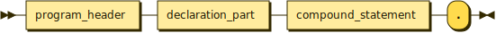

```
program  ::= program_header declaration_part compound_statement '.'
```

**program_header:**

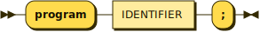

```
program_header
         ::= 'program' IDENTIFIER ';'
```

referenced by:

* program

**declaration_part:**

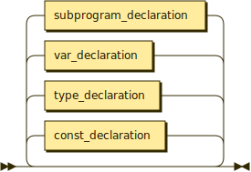

```
declaration_part
         ::= ( const_declaration | type_declaration | var_declaration | subprogram_declaration )*
```

referenced by:

* function_declaration
* procedure_declaration
* program

**const_declaration:**

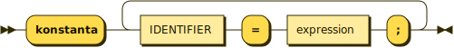

```
const_declaration
         ::= 'konstanta' ( IDENTIFIER '=' expression ';' )+
```

referenced by:

* declaration_part

**type_declaration:**

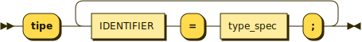

```
type_declaration
         ::= 'tipe' ( IDENTIFIER '=' type_spec ';' )+
```

referenced by:

* declaration_part

**var_declaration:**

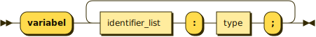

```
var_declaration
         ::= 'variabel' ( identifier_list ':' type ';' )+
```

referenced by:

* declaration_part

**identifier_list:**

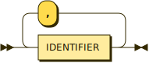

```
identifier_list
         ::= IDENTIFIER ( ',' IDENTIFIER )*
```

referenced by:

* parameter_group
* var_declaration

**type_spec:**

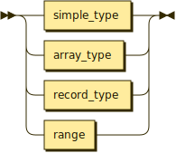

```
type_spec
         ::= simple_type
           | array_type
           | record_type
           | range
```

referenced by:

* record_type
* type_declaration

**simple_type:**

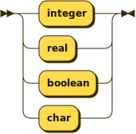

```
simple_type
         ::= 'integer'
           | 'real'
           | 'boolean'
           | 'char'
```

referenced by:

* type
* type_spec

**type:**

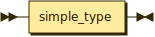

```
type     ::= simple_type
```

referenced by:

* array_type
* function_declaration
* parameter_group
* var_declaration

**array_type:**

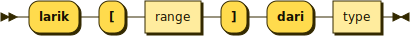

```
array_type
         ::= 'larik' '[' range ']' 'dari' type
```

referenced by:

* type_spec

**record_type:**

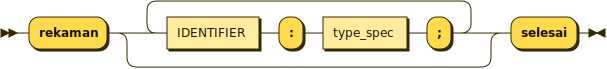

```
record_type
         ::= 'rekaman' ( IDENTIFIER ':' type_spec ';' )* 'selesai'
```

referenced by:

* type_spec

**range:**

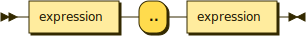

```
range    ::= expression '..' expression
```

referenced by:

* array_type
* type_spec

**subprogram_declaration:**

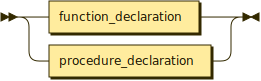

```
subprogram_declaration
         ::= function_declaration
           | procedure_declaration
```

referenced by:

* declaration_part

**function_declaration:**

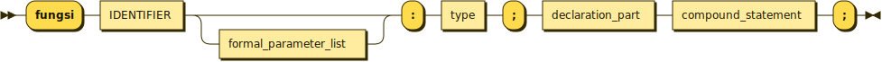

```
function_declaration
         ::= 'fungsi' IDENTIFIER formal_parameter_list? ':' type ';' declaration_part compound_statement ';'
```

referenced by:

* subprogram_declaration

**procedure_declaration:**

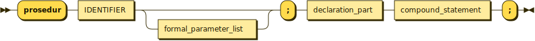

```
procedure_declaration
         ::= 'prosedur' IDENTIFIER formal_parameter_list? ';' declaration_part compound_statement ';'
```

referenced by:

* subprogram_declaration

**formal_parameter_list:**

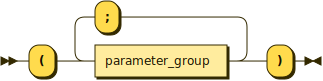

```
formal_parameter_list
         ::= '(' parameter_group ( ';' parameter_group )* ')'
```

referenced by:

* function_declaration
* procedure_declaration

**parameter_group:**

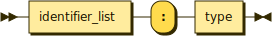

```
parameter_group
         ::= identifier_list ':' type
```

referenced by:

* formal_parameter_list

**compound_statement:**

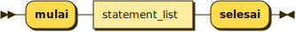

```
compound_statement
         ::= 'mulai' statement_list 'selesai'
```

referenced by:

* function_declaration
* procedure_declaration
* program
* single_statement

**statement_list:**

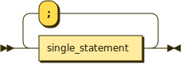

```
statement_list
         ::= single_statement ( ';' single_statement )*
```

referenced by:

* compound_statement

**single_statement:**

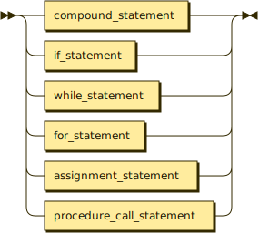

```
single_statement
         ::= compound_statement
           | if_statement
           | while_statement
           | for_statement
           | assignment_statement
           | procedure_call_statement
```

referenced by:

* for_statement
* if_statement
* statement_list
* while_statement

**assignment_statement:**

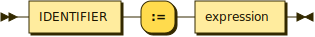

```
assignment_statement
         ::= IDENTIFIER ':=' expression
```

referenced by:

* single_statement

**procedure_call_statement:**

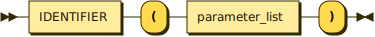

```
procedure_call_statement
         ::= IDENTIFIER '(' parameter_list ')'
```

referenced by:

* single_statement

**parameter_list:**


```
parameter_list
         ::= expression ( ',' expression )*
```

referenced by:

* procedure_call_statement

**if_statement:**

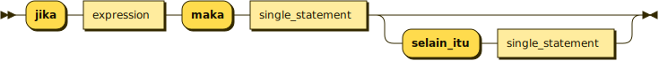

```
if_statement
         ::= 'jika' expression 'maka' single_statement ( 'selain_itu' single_statement )?
```

referenced by:

* single_statement

**while_statement:**

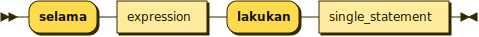

```
while_statement
         ::= 'selama' expression 'lakukan' single_statement
```

referenced by:

* single_statement

**for_statement:**

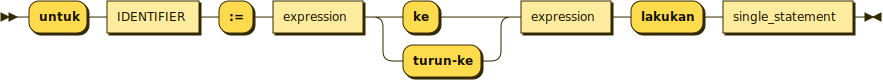

```
for_statement
         ::= 'untuk' IDENTIFIER ':=' expression ( 'ke' | 'turun-ke' ) expression 'lakukan' single_statement
```

referenced by:

* single_statement

**relational_operator:**

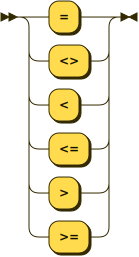

```
relational_operator
         ::= '='
           | '<>'
           | '<'
           | '<='
           | '>'
           | '>='
```

**additive_operator:**

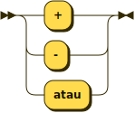

```
additive_operator
         ::= '+'
           | '-'
           | 'atau'
```

**multiplicative_operator:**

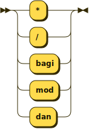

```
multiplicative_operator
         ::= '*'
           | '/'
           | 'bagi'
           | 'mod'
           | 'dan'
```

## 
 <sup>generated by [RR - Railroad Diagram Generator][RR]</sup>

[RR]: https://www.bottlecaps.de/rr/ui